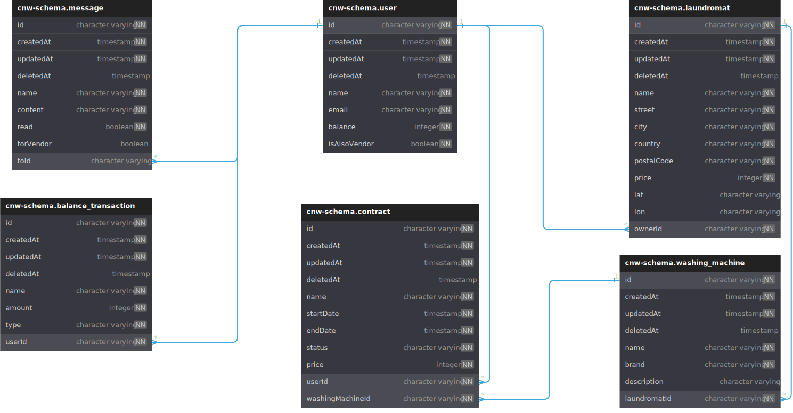

# Click n' Wash

## Our Website

Feel free to check our [website](https://clicknwash.pro/).

## Table of Contents

1. [About Click n' Wash](#about)
2. [Features](#features)
3. [Getting Started](#started)
4. [Database Structures](#database-structure)
5. [API Routes](#api-routes)
6. [Pages](#pages)
7. [Components](#components)
8. [Tests](#tests)
9. [Tech Stacks](#tech-stacks)
10. [Authors](#authors)

## About Click n' Wash <a name="about"/>

Click n' Wash is a student-led initiative aimed at simplifying the laundry experience for individuals residing in the student dormitory. Faced with the inconvenience of traditional laundry routines, the team developed a user-friendly website to transform and digitize the laundromat experience. Click n' Wash offers a seamless online platform where users can effortlessly book and monitor the availability of washing machines. This innovative solution eliminates the need for physical visits to the laundromat, providing a convenient and time-efficient alternative.

## Features <a name="features"/>

- **Book a Washing machine**: a user can book a washing machine directly from the web when the washing machine is available.
- **Check the availability of a Washing machine**: a user can check the availability of a washing machine directly from the website, without the need to go to the laundromat.
- **Report a Problem**: a user can report a problem to the technician or the owner of the laundromat when the washing machine has an issue.
- **Search the nearest Laundromat**: the user can search for the nearest Laundromat from their location.
- **Manage a Laundromat**: a vendor can manage their laundromat.
- **Manage a Booking**: a user can manage or cancel their booking.
- **Topup balance**: a user can top up their balance for the payment method for the washing machine.
- **Transaction History**: user can see their transaction history.
- **Become a Vendor**: Users can become a vendor to open their laundromat.
- **Refund System**: a vendor can refund the transaction to the user when there is an error with the machine.

## Getting Started <a name="started"/>

### Prerequisites

To get started with the application, make sure you have the following prerequisites installed:

- [Node.js](https://nodejs.org/en/)
- [npm](https://www.npmjs.com/)
- [Docker](https://www.docker.com/)
- [Docker Compose](https://docs.docker.com/compose/)
- [PostgreSQL](https://www.postgresql.org/)

### Installation

1. Clone the repository

```bash
git clone https://code.fbi.h-da.de/click-n-wash/click-n-wash.git
```

2. Configure the environment variables( .env)
   Create and fill the environment variables in the `.env` and make sure the file is located in the root folder. You can use the [`env.example`](./.env.example) file as a template. Firebase environment variables are required for the program to work.

3. Installation Methods:

#### Docker Compose

1. To provide a one-command solution for starting the application, we have provided a `docker-compose.yml` file. To start the application, run the following command in the root directory of the project:

```
docker-compose up -d
```

2. Go to http://localhost:8080/ to see the website or whatever port you have set in the `.env` file.

#### Manual Installation

1. Start the Database:

```bash
docker compose up -d click-n-wash-db
```

2. Start the Backend:

```bash
cd back-end/
npm i
npm run dev
```

3. Start the Frontend:

```bash
cd front-end/
npm i
npm run dev
```

4. Open the website:

```bash
http://localhost:5173/
```

### Seeding

To seed the database with dummy data, run the following command:

```bash
cd back-end/
npm run seed
```

## Database Structures <a name="database-structure"/>

This website uses PostgreSQL as the database, with typeORM as the ORM. The database consists of 6 tables: `BalanceTransaction`, `Contract`, `Laundromat`, `Message`, `User`, and `WashingMachine`.



## API Routes <a name="api-routes"/>

The API routes are divided into 5 categories: `Users`, `Laundromats`, `Washing Machines`, `Contracts`, and `Balance Transactions`. We use SWAGGER to document our API. You can check the API documentation [here](https://clicknwash.pro/docs/). You can also check the API documentation locally by going to http://localhost:8080/docs/.

## Pages <a name="pages"/>

### Home Page

On this page, the user will see a map that shows the location of the laundromats and also a list of the available laundromats.

### Inbox Page

On this page, the user and the vendor can see the list of messages that they got about their booking or their laundromats.

### Manage Bookings Page

Here the user can see the list of their booking and the details of the booking. the user can also cancel their booking or report a problem with the washing machine on this page.

### Balance Page

On this page, the user can see their transaction list, and their current balance and also top up their balance.

### Manage Laundromats

This page is only available to vendors. On this page, the vendor can manage their laundromat information and also add or delete a washing machine.

### Edit Laundromats

On this page, the vendor can edit their laundromat information.

### Washing Machine Detail Page

On this page, the vendor can see the details of the washing machine and also change the information about the washing machine. Here the vendor can also see the list of contracts and refund or cancel a contract when something's wrong happened to the washing machine.

## Components <a name="components"/>

### Navbar

We have a navigation bar as a component to help the user navigate through our website comfortably.

### Authentication Form

This component will pop up in the middle of the screen and show the login or authentication form to the user.

### Goggle Button

This component will help the user to log in to our website with their own Google account.

### Filter

This component will help the user to find the nearest or cheapest laundromat. In this component, the user can set a filter for the laundromats.

### Map

This component will show an OpenStreetMap API on the homepage to show the location of the laundromats.

### TimePicker

With the help of this component, the user can choose which date they want and also which time for the booking of the washing machine.

### Washing Machine Picker

With this component, the user can pick which machine they want to book.

### Add Funds Modal

This component is used on the balance page to help the user top up their balance.

### Add Washing Machine Modal

This component will show a form for the detail of the washing machine, that will be added to the laundromat.

## Tests <a name="tests"/>

We have 2 different tests in our project. the first one is to test our backend. and the second one is an end-to-end test for our frontend with the help of CyPress.

### Backend Test

1. Make sure that the database is already running before we do the backend test.

```bash
docker compose up -d click-n-wash-db
```

2. Install all the dependencies that are needed for the backend.

```bash
cd back-end/
npm i
```

3. start the test by running the following command.

```bash
cd back-end/
npm test
```

### Frontend Test

1. Make sure that the docker, the backend, and also the frontend are already running. before we do the frontend test. [with a seeded Database](#seeding).

```bash
cd back-end/
docker compose up -d
```

```bash
cd back-end/
npm run dev
```

2. Install all the dependencies that are needed for the frontend and run it.

```bash
cd front-end/
npm i
```

```bash
cd front-end/
npm run dev
```

3. Run the frontend with the help of Cypress. There are 2 choices of commands to run the test.

- First Option(with UI)

```bash
cd front-end/
npx cypress open
```

After that, a pop-up screen from Cypress will appear. Select 'E2E Testing' and choose your preferred browser for testing. Finally, run the test based on the sequence of the filename.

- Second Option(with npx cypress run --headless)(without UI)

```bash
cd front-end/
npm run test
```

With the second Option, the test will run in the terminal. If there are Errors, it will be saved in the file ./frontend/cypress/screenshots.

## Tech Stacks <a name="tech-stacks"/>

### Frontend

- [React](https://reactjs.org/) - JavaScript library for building user interfaces
- [React Router](https://reactrouter.com/) - React routing library
- [Vite](https://vitejs.dev/) - Build tool
- [Mantine](https://mantine.dev/) - React CSS Framework
- [Firebase](https://firebase.google.com/) - Google base login service
- [Openstreetmap](https://www.openstreetmap.org/#map=6/51.330/10.453) - World map API
- [Cypress](https://www.cypress.io/) - End To End Testing

### Backend

- [PostgreSQL](https://www.postgresql.org/) - Database
- [TypeORM](https://typeorm.io/) - ORM
- [Firebase](https://firebase.google.com/) - Authentication service
- [Mocha](https://mochajs.org/) - Testing framework
- [Chai](https://www.chaijs.com/) - Assertion library
- [tsc-watch](https://www.npmjs.com/package/tsc-watch) -TypeScript compiler
- [Express](https://expressjs.com/) - Web framework
- [Faker](https://www.npmjs.com/package/@faker-js/faker) - Dummy Data Generator
- [Swagger](https://swagger.io/) - API Documentation
- [Express-oas-generator](https://www.npmjs.com/package/express-oas-generator) - OpenAPI Specification Generator

### Other tools

- [Docker](https://www.docker.com/) - Containerization platform
- [Docker Compose](https://docs.docker.com/compose/) - Tool for defining and running multi-container Docker applications
- [ESLint](https://eslint.org/) - Linter
- [Prettier](https://prettier.io/) - Code formatter

## Authors <a name="authors"/>

- [Vinston Salim, 772744]
- [Bernhard Ricardo Putranto, 772543]
- [Agustinus Nicander Hery, 772535]
- [Moses Antonio, 1112599]
- [Vinsky Strauss TanHanSen, 772529]
